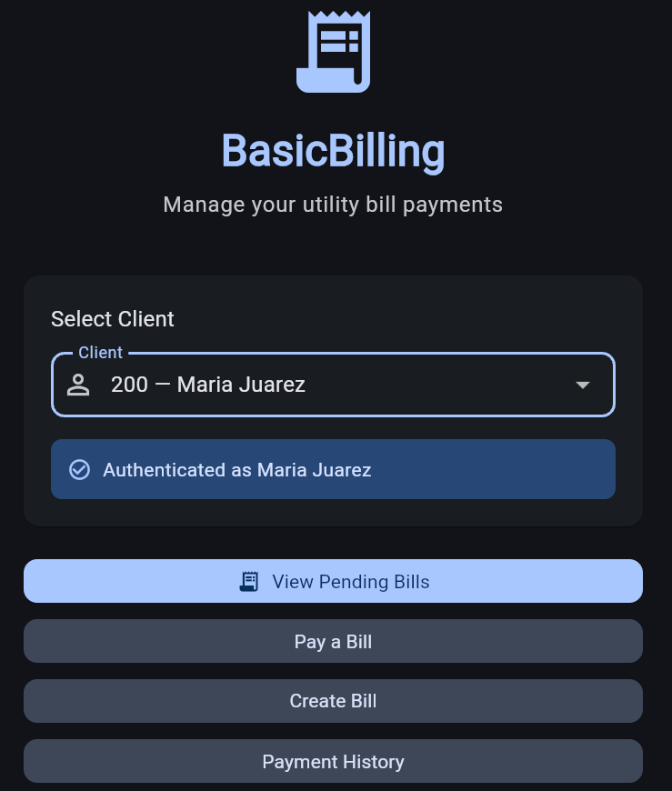
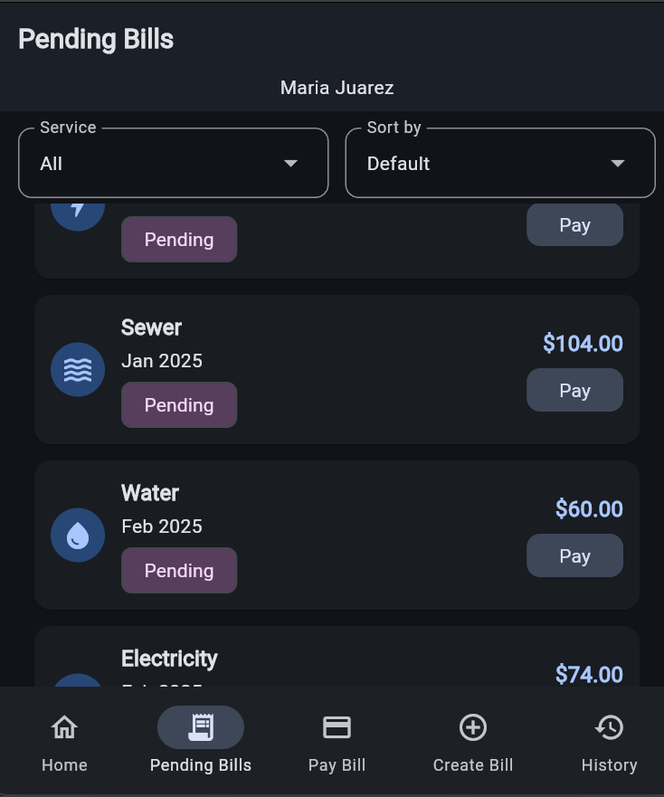
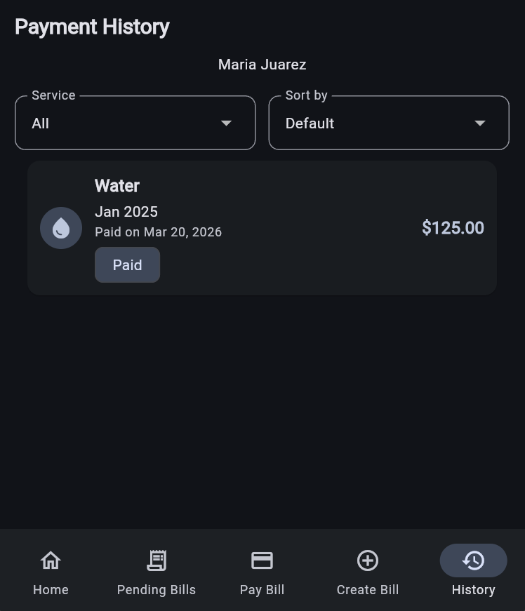
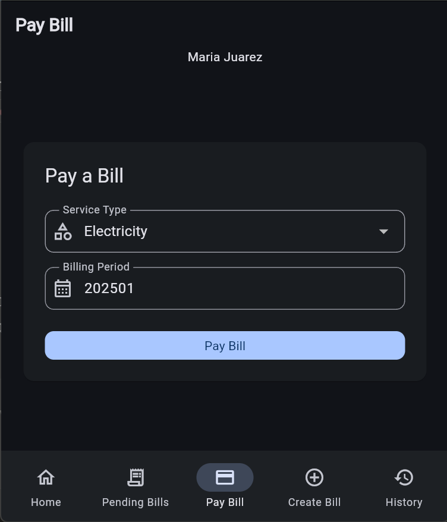
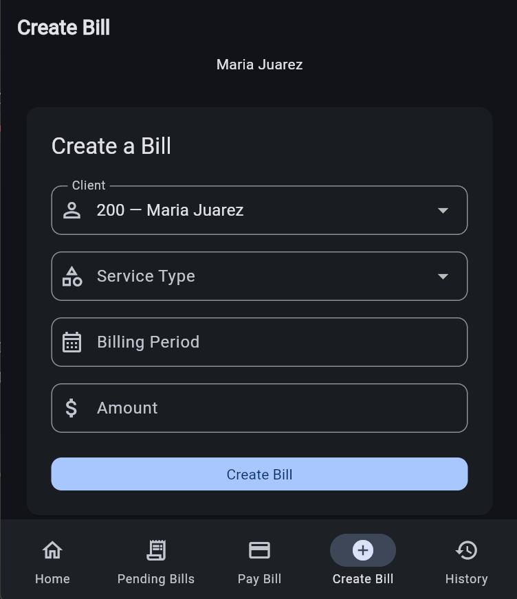

# BasicBilling Frontend

Flutter web app for managing utility bill payments built as a technical test for NEXION.

**Backend repository:** https://github.com/pacha2880/basic-billing-backend

## Tech Stack
- Flutter web — Dart
- flutter_bloc — state management
- Dio — HTTP client with JWT interceptor
- go_router — navigation
- Material Design 3

## How to Run
1. Make sure the backend API is running on http://localhost:5214
2. Run the frontend:

```
flutter run -d chrome
```

## How to Build
```
flutter build web
```

## Screens

<table>
  <tr>
    <td><br/><sub>Home</sub></td>
    <td><br/><sub>Pending Bills</sub></td>
    <td><br/><sub>Payment History</sub></td>
    <td><br/><sub>Pay Bill</sub></td>
    <td><br/><sub>Create Bill</sub></td>
  </tr>
</table>

## Features
- Client selection with automatic JWT authentication
- View pending bills with OData filtering and sorting
- Pay bills inline or via form
- Create new bills with validation
- View payment history with OData filtering and sorting
- Responsive layout: NavigationRail on desktop, BottomNavigationBar on mobile
- Dark mode support
- Friendly error messages from API

## Architecture
- flutter_bloc for all state management (Bloc pattern, not Cubit)
- Repositories as the only layer that talks to the API
- Screens never call the API directly
- Dio interceptor injects JWT token automatically on every request
- OData query parameters built in repositories and passed to backend

## Development Process
- [Development Plan](docs/plan.md)
- [Architecture Reference](docs/architecture.md)
- [Decision Log](docs/decisions.md)

## What I would add with more time
- Unit and widget tests for blocs and screens
- OData combined filters (service type + date range)
- Android build and testing
- Offline support with local caching

## Not Implemented
- Unit tests (deferred due to time constraints)
- Android build (optional bonus)
